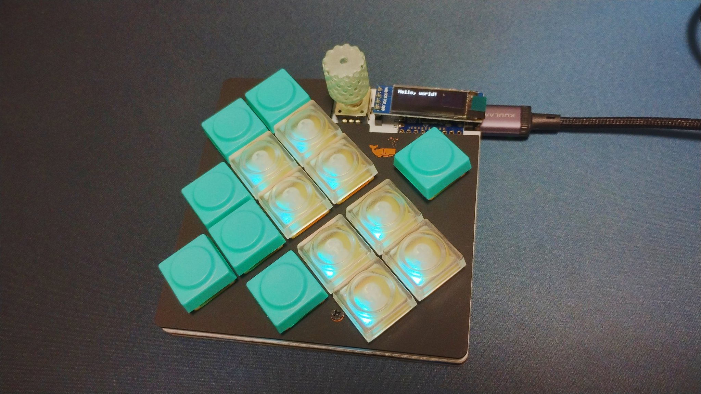

# ISW-DIAMOND VEIN

ISW-DIAMOND VEIN is a gaming macro pad designed primarily for playing Minecraft.

[Build guide](doc/buildguide.md)

## Build Log
* [【ビルドログ】isw_diamond_vein｜五月雨](https://note.com/sam1dare/n/nfea799ef7a6a)

## Dependencies (KiCad)
* [is-watering/isw-kbd-lib](https://github.com/is-watering/isw-kbd-lib)
* [Salicylic-acid3/KiCAD_FootPrint](https://github.com/Salicylic-acid3/KiCAD_FootPrint)
* [koktoh/BrownSugar_KBD_KiCad_Library](https://github.com/koktoh/BrownSugar_KBD_KiCad_Library)
