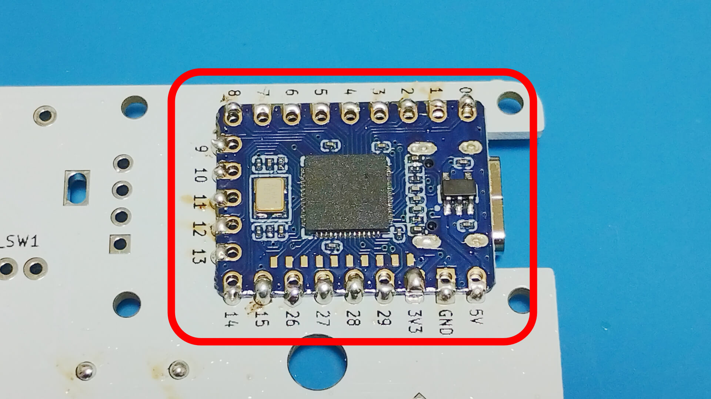
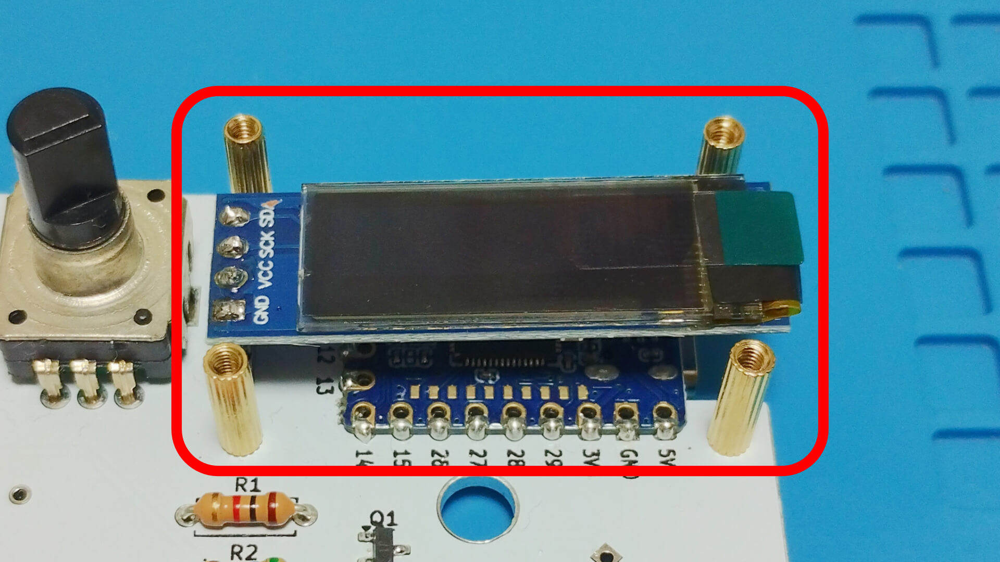
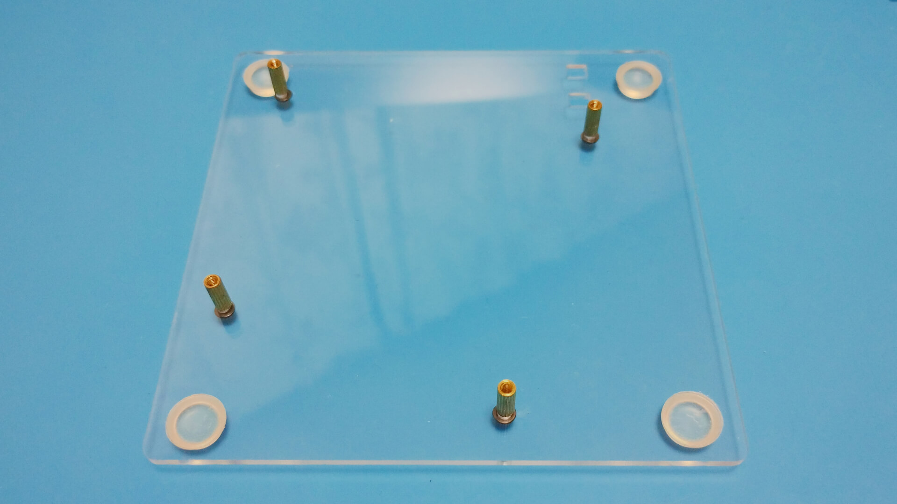
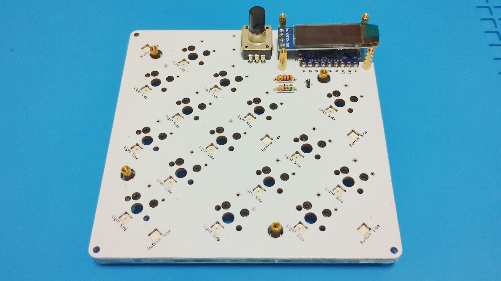
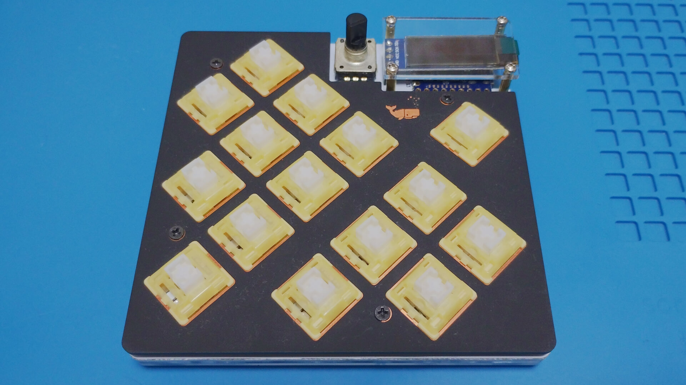
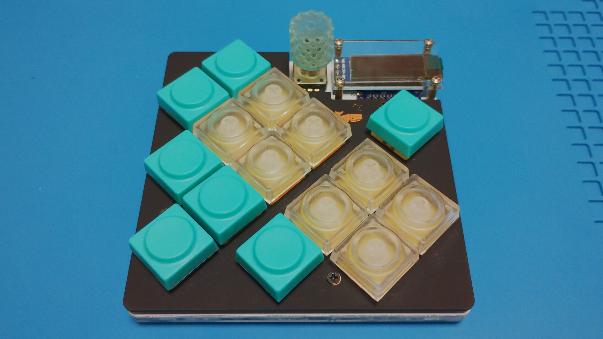

# Build guide

## Parts
Name                     |Quantity |Notes
-------------------------|---------|-----
PCB                      |1        | |
Switch plate             |1        | |
Bottom plate             |1        | |
SK6812 MINI-E leds       |20        | |
1N4148W diodes           |16       | |
Kailh hotswap sockets    |15       | |
EC12 rotary encoder  |1    |Height 15mm or more recommended|
FSS-41035-04 4P pinsocket |1    |[HIROSUGI NET](https://www.hirosugi-net.co.jp/shop/goods/goods.aspx?goods=24081), [Yushakobo](https://shop.yushakobo.jp/products/a1600ps-01-1)|
PSS-410153-04 4P pinheader |1    |[HIROSUGI NET](https://www.hirosugi-net.co.jp/shop/g/g21243/), [Yushakobo](https://shop.yushakobo.jp/products/a1600ph-01-1)|
OLED module 128x32  |1    | |
RP2040-Zero              |1        | |
M2x4mm screws            |16        | |
M2x8mm spacers           |4        |[HIROSUGI NET](https://www.hirosugi-net.co.jp/shop/c/c10141012/)|
M2x10mm Knurled spacers   |4        |[Aliexpress](https://www.aliexpress.com/item/1005002979083511.html)|

## Build PCB

### [Leds](https://github.com/is-watering/isw-kbd-building-tips/blob/main/doc/soldering-sk6812mini-e.md)

### [Diodes](https://github.com/is-watering/isw-kbd-building-tips/blob/main/doc/soldering-1n4148w.md)

### [Hotswap sockets](https://github.com/is-watering/isw-kbd-building-tips/blob/main/doc/soldering-cpg151101s11.md)

### RP2040-Zero
It is recommended to check whether the firmware can be written to the microcontroller in advance.
* [Soure code](https://github.com/is-watering/isw_diamond_vein/tree/main/firmware)

Solder the microcontroller from the top of the PCB, face down, using surface mount soldering.  
[Learn more about how to solder microcontrollers](https://github.com/is-watering/isw-kbd-building-tips/blob/main/doc/surfacemount-rp2040-zero.md)

### [4P pinsocket](https://github.com/is-watering/isw-kbd-building-tips/blob/main/doc/soldering-4p-pinsocket.md)

### [EC12 rotary encoder](https://github.com/is-watering/isw-kbd-building-tips/blob/main/doc/soldering-ec12.md)

Fix 10 mm knurled spacers from the backside of the PCB with 4 mm screws.  
Next, attach the OLED to the 4P pin socket.  

## Build Case
Use a 4mm screw to secure the 8mm spacer.  

Place the PCB on the bottom plate.  

Place the switch plate on the PCB. It is easier to align key switches if they are mounted from the corners.  

Fit the remaining keyswitch and secure the switch plate and cover plate with 4 mm screws.  

Complete the installation with a keycap of your choice and a rotary encoder knob!

Congratulations on the completion!  
Please be proud of it on social networking sites!  
`#isw_kbd`